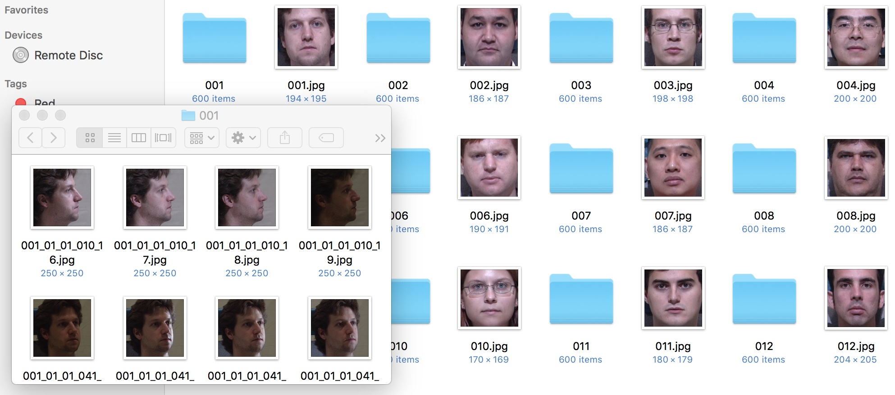
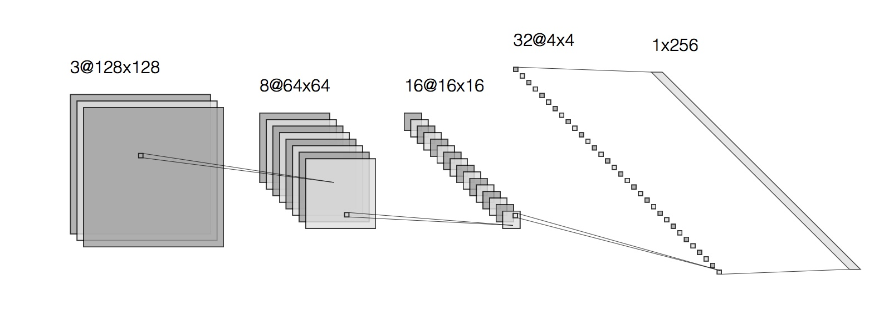
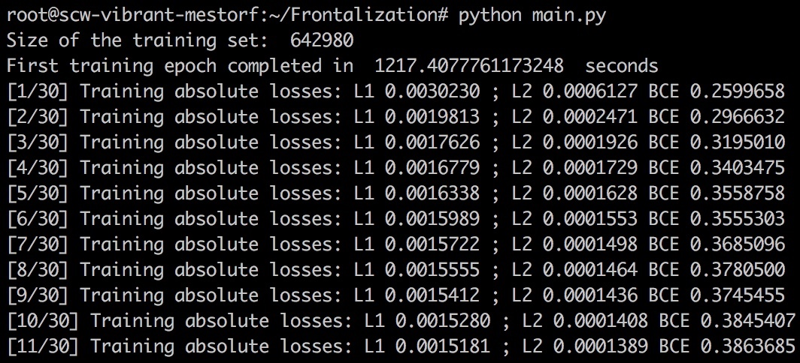
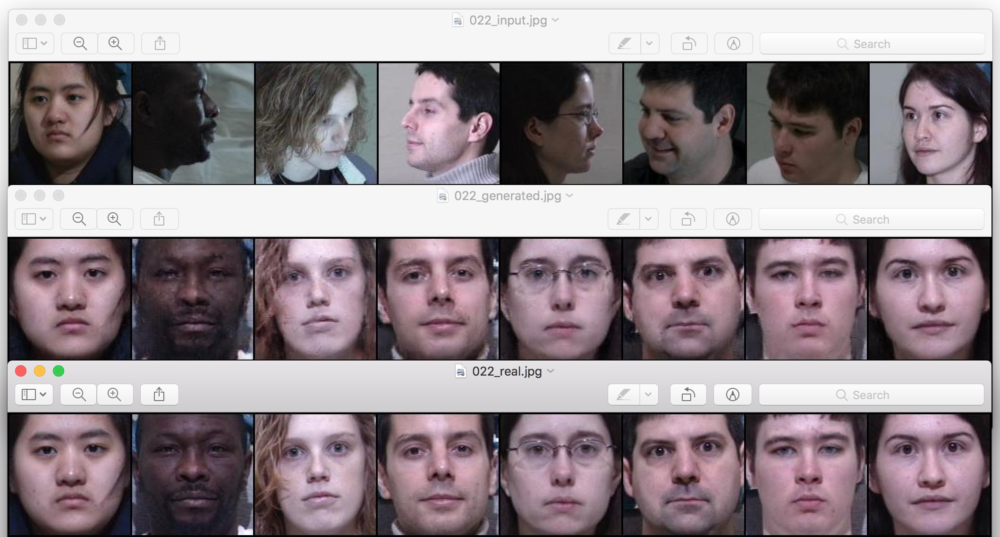
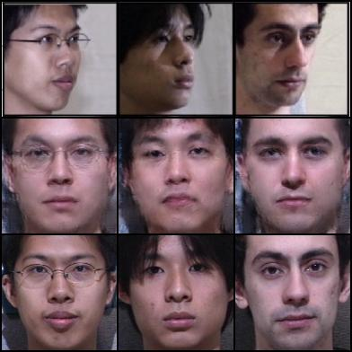

# Pytorch implementation of a face frontalization GAN

## Introduction

Screenwriters never cease to amuse us with bizarre portrayals of the tech industry, ranging [from cringeworthy to hilarious](https://www.reddit.com/r/ZoomEnhance/). With the current advances in artificial intelligence, however, some of the most unrealistic technologies from the TV screens are coming to life. For example, the Enhance software from *CSI: NY* (or *Les Experts : Manhattan* for the francophone readers) has already been outshone by the state-of-the-art [Super Resolution neural networks](https://medium.com/@jonathan_hui/gan-super-resolution-gan-srgan-b471da7270ec). On a more extreme side of the imagination, there is *Enemy of the state*:

[](https://www.youtube.com/watch?v=3EwZQddc3kY?)  

"Rotating [a video surveillance footage] 75 degrees around the vertical" must have seemed completely nonsensical long after 1998 when the movie came out, evinced by the youtube comments below this particular excerpt:   


Despite the apparent pessimism of the audience, thanks to machine learning today anyone with a little bit of Python knowledge and a large enough dataset can take a stab at writing a sci-fi drama worthy program.

## The face frontalization problem

Forget MNIST, forget the boring cat vs. dog classifiers, today we are going to learn how to do something far more exciting! This project was inspired by the impressive work by R. Huang et al. [(Beyond Face Rotation: Global and Local Perception GAN for Photorealistic and Identity Preserving Frontal View Synthesis)](https://arxiv.org/abs/1704.04086), in which the authors synthesise frontal views of people's faces given their images at various angles. Below is Figure 3 from that paper, in which they compare their results [\[1\]](https://arxiv.org/abs/1704.04086) to previous work [2-6]:

|   | |  |    |  |  | | |
|---|---|---|---|---|---|---|---|
| Input  | [\[1\]](https://arxiv.org/abs/1704.04086)  | [\[2\]](http://openaccess.thecvf.com/content_cvpr_2017/papers/Tran_Disentangled_Representation_Learning_CVPR_2017_paper.pdf)   | [\[3\]](https://ieeexplore.ieee.org/document/7298667)  | [\[4\]](https://arxiv.org/abs/1511.08446)  | [\[5\]](https://ieeexplore.ieee.org/document/7298679)   | [\[6\]](https://arxiv.org/abs/1411.7964)  | Actual frontal  |
|<td colspan=7>Comparison of multiple face frontalization methods [\[1\]](https://arxiv.org/abs/1704.04086)|

We are not going to try to reproduce the state-of-the-art model by R. Huang et al. Instead, we will construct and train a face frontalization model, producing reasonable results in a single afternoon:

| input  | |
|---|---|
| generated output  |   |

Additionally, we will go over:

1. How to use NVIDIA's `DALI` library for highly optimized pre-processing of images on the GPU and feeding them into a deep learning model.

2. How to code a Generative Adversarial Network, praised as “the most interesting idea in the last ten years in Machine Learning” by Yann LeCun, the director of Facebook AI, in `PyTorch`

You will also have your very own Generative Adversarial Network set up to be trained on a dataset of your choice. Without further ado, let's dig in!

## Setting Up Your Data

At the heart of any machine learning project, lies the data. Unfortunately, Scaleway cannot provide the [CMU Multi-PIE Face Database](http://www.cs.cmu.edu/afs/cs/project/PIE/MultiPie/Multi-Pie/Home.html) that we used for training due to copyright, so we shall proceed assuming you already have a dataset that you would like to train your model on. In order to make use of [NVIDIA Data Loading Library (DALI)](https://github.com/NVIDIA/DALI), the images should be in JPEG format. The dimensions of the images do not matter, since we have DALI to resize all the inputs to the input size required by our network (128 x 128 pixels), but a 1:1 ratio is desirable to obtain the most realistic synthesised images.
The advantage of using DALI over, e.g., a standard PyTorch Dataset, is that whatever pre-processing (resizing, cropping, etc) is necessary, is performed on the GPU rather than the CPU, after which pre-processed images on the GPU are fed straight into the neural network.

### Managing our dataset:

For the face frontalization project, we set up our dataset in the following way: the dataset folder contains a subfolder and a target frontal image for each person (aka subject). In principle, the names of the subfolders and the target images do not have to be identical (as they are in the Figure below), but if we are to separately sort all the subfolders and all the targets alphanumerically, the ones corresponding to the same subject must appear at the same position on the two lists of names.

As you can see, subfolder `001/` corresponding to subject 001 contains images of the person pictured in `001.jpg` - these are closely cropped images of the face under different poses, lighting conditions, and varying face expressions. For the purposes of face frontalization, it is crucial to have the frontal images aligned as close to one another as possible, whereas the other (profile) images have a little bit more leeway.

For instance, our target frontal images are all squares and cropped in such a way that the bottom of the person's chin is located at the bottom of the image, and the centred point between the inner corners of the eyes is situated at *0.8h* above and *0.5h* to the right of the lower left corner (*h* being the image's height). This way, once the images are resized to 128 x 128, the face features all appear at more or less the same locations on the images in the training set, and the network can learn to generate the said features and combine them together into realistic synthetic faces.



### Building a DALI `Pipeline`:

We are now going to build a pipeline for our dataset that is going to inherit from `nvidia.dali.pipeline.Pipeline`. At the time of writing, DALI does not directly support reading (image, image) pairs from a directory, so we will be making use of `nvidia.dali.ops.ExternalSource()` to pass the inputs and the targets to the pipeline.

##### `data.py`
```
import collections
from random import shuffle
import os
from os import listdir
from os.path import join

import numpy as np
from nvidia.dali.pipeline import Pipeline
import nvidia.dali.ops as ops            
import nvidia.dali.types as types


def is_jpeg(filename):
    return any(filename.endswith(extension) for extension in [".jpg", ".jpeg"])


def get_subdirs(directory):
    subdirs = sorted([join(directory,name) for name in sorted(os.listdir(directory)) if os.path.isdir(os.path.join(directory, name))])
    return subdirs


flatten = lambda l: [item for sublist in l for item in sublist]


class ExternalInputIterator(object):

    def __init__(self, imageset_dir, batch_size, random_shuffle=False):
        self.images_dir = imageset_dir
        self.batch_size = batch_size

        # First, figure out what are the inputs and what are the targets in your directory structure:
        # Get a list of filenames for the target (frontal) images
        self.frontals = np.array([join(imageset_dir, frontal_file) for frontal_file in sorted(os.listdir(imageset_dir)) if is_jpeg(frontal_file)])

        # Get a list of lists of filenames for the input (profile) images for each person
        profile_files = [[join(person_dir, profile_file) for profile_file in sorted(os.listdir(person_dir)) if is_jpeg(profile_file)] for person_dir in get_subdirs(imageset_dir)]

        # Build a flat list of frontal indices, corresponding to the *flattened* profile_files
        # The reason we are doing it this way is that we need to keep track of the multiple inputs corresponding to each target
        frontal_ind = []
        for ind, profiles in enumerate(profile_files):
            frontal_ind += [ind]*len(profiles)
        self.frontal_indices = np.array(frontal_ind)

        # Now that we have built frontal_indices, we can flatten profile_files
        self.profiles = np.array(flatten(profile_files))

        # Shuffle the (input, target) pairs if necessary: in practice, it is profiles and frontal_indices that get shuffled
        if random_shuffle:
            ind = np.array(range(len(self.frontal_indices)))
            shuffle(ind)
            self.profiles = self.profiles[ind]
            self.frontal_indices = self.frontal_indices[ind]


    def __iter__(self):
        self.i = 0
        self.n = len(self.frontal_indices)
        return self


    # Return a batch of (input, target) pairs
    def __next__(self):
        profiles = []
        frontals = []

        for _ in range(self.batch_size):
            profile_filename = self.profiles[self.i]
            frontal_filename = self.frontals[self.frontal_indices[self.i]]

            profile = open(profile_filename, 'rb')
            frontal = open(frontal_filename, 'rb')

            profiles.append(np.frombuffer(profile.read(), dtype = np.uint8))
            frontals.append(np.frombuffer(frontal.read(), dtype = np.uint8))

            profile.close()
            frontal.close()

            self.i = (self.i + 1) % self.n
        return (profiles, frontals)

    next = __next__


class ImagePipeline(Pipeline):
    '''
    Constructor arguments:  
    - imageset_dir: directory containing the dataset
    - image_size = 128: length of the square that the images will be resized to
    - random_shuffle = False
    - batch_size = 64
    - num_threads = 2
    - device_id = 0
    '''

    def __init__(self, imageset_dir, image_size=128, random_shuffle=False, batch_size=64, num_threads=2, device_id=0):
        super(ImagePipeline, self).__init__(batch_size, num_threads, device_id, seed=12)  
        eii = ExternalInputIterator(imageset_dir, batch_size, random_shuffle)
        self.iterator = iter(eii)
        self.num_inputs = len(eii.frontal_indices)

        # The source for the inputs and targets
        self.input = ops.ExternalSource()
        self.target = ops.ExternalSource()

        # nvJPEGDecoder below accepts  CPU inputs, but returns GPU outputs (hence device = "mixed")
        self.decode = ops.nvJPEGDecoder(device = "mixed", output_type = types.RGB)

        # The rest of pre-processing is done on the GPU
        self.res = ops.Resize(device="gpu", resize_x=image_size, resize_y=image_size)
        self.norm = ops.NormalizePermute(device="gpu", output_dtype=types.FLOAT,
                                         mean=[128., 128., 128.], std=[128., 128., 128.],
                                         height=image_size, width=image_size)


    # epoch_size = number of (profile, frontal) image pairs in the dataset
    def epoch_size(self, name = None):
        return self.num_inputs


    # Define the flow of the data loading and pre-processing
    def define_graph(self):    
        self.profiles = self.input(name="inputs")
        self.frontals = self.target(name="targets")
        profile_images = self.decode(self.profiles)
        profile_images = self.res(profile_images)
        profile_output = self.norm(profile_images)
        frontal_images = self.decode(self.frontals)
        frontal_images = self.res(frontal_images)
        frontal_output = self.norm(frontal_images)
        return (profile_output, frontal_output)


    def iter_setup(self):
        (images, targets) = self.iterator.next()
        self.feed_input(self.profiles, images)
        self.feed_input(self.frontals, targets)
```

You can now use the `ImagePipeline` class that you wrote above to load images from your dataset directory, one batch at a time.

If you are using the code from this tutorial inside a Jupyter notebook, here is how you can use an `ImagePipeline` to display the images:
```
from __future__ import division
import matplotlib.gridspec as gridspec
import matplotlib.pyplot as plt
%matplotlib inline


def show_images(image_batch, batch_size):
    columns = 4
    rows = (batch_size + 1) // (columns)
    fig = plt.figure(figsize = (32,(32 // columns) * rows))
    gs = gridspec.GridSpec(rows, columns)

    for j in range(rows*columns):
        plt.subplot(gs[j])
        plt.axis("off")
        plt.imshow(np.transpose(image_batch.at(j), (1,2,0)))


batch_size = 8
pipe = ImagePipeline('my_dataset_directory', image_size=128, batch_size=batch_size)
pipe.build()
profiles, frontals = pipe.run()


# The images returned by ImagePipeline are currently on the GPU
# We need to copy them to the CPU via the asCPU() method in order to display them
show_images(profiles.asCPU(), batch_size=batch_size)
show_images(frontals.asCPU(), batch_size=batch_size)
```

## Setting Up Your Neural Network

Here comes the fun part, building the network's architecture! We assume that you are already somewhat familiar with the idea behind convolutional neural networks, the architecture of choice for many computer vision applications today.
Beyond that, there are two main concepts that we will need for the face Frontalization project, that we shall touch upon in this section:

* the Encoder / Decoder Network(s) and
* the Generative Adversarial Network.

### Encoders and Decoders

#### The Encoder

As mentioned above, our network takes images that are sized 128 by 128 as input. Since the images are in colour (meaning 3 colour channels for each pixel), this results in the input being 3x128x128=49152 dimensional. Perhaps we do not need all 49152 values to describe a person's face? This turns out to be correct: we can get away with a mere 512 dimensional vector (which is simply another way of saying "512 numbers") to encode all the information that we care about. This is an example of *dimensionality reduction*: the Encoder network (paired with the network responsible for the inverse process, *decoding*) learns a lower dimensional representation of the input. The architecture of the Encoder may look something like this:
   

Here we start with input that is 128x128 and has 3 channels. As we pass it through convolutional layers, the size of the input gets smaller and smaller (from 128x128 to 64x64 to 16x16 etc on the Figure above) whereas the number of channels grows (from 3 to 8 to 16 and so on). This reflects the fact that the deeper the convolutional layer, the more abstract are the features that it learns. In the end we get to a layer whose output is sized 1x1, yet has a very high number of channels: 256 in the example depicted above (or 512 in our own network). 256x1 and 1x256 are really the same thing, if you think about it, so another way to put it is that the output of the Encoder is 256 dimensional (with a single channel), so we have reduced the dimensionality of the original input from 49152 to 256! Why would we want to do that? Having this lower dimensional representation helps us prevent overfitting our final model to the training set.

In the end, what we want is a representation (and hence, a model) that is precise enough to fit the training data well, yet does not overfit - meaning, that it can be generalised to the data it has not seen before as well.

#### The Decoder

As the name suggests, the Decoder's job is the inverse of that of the Encoder. In other words, it takes the low-dimensional representation output of the Encoder and has it go through *deconvolutional* layers (also known as the [transposed convolutional layers](https://datascience.stackexchange.com/questions/6107/what-are-deconvolutional-layers)). The architecture of the Decoder network is often symmetric to that of the Encoder, although this does not have to be the case. The Encoder and the Decoder are often combined into a single network, whose inputs and outputs are both images:


In our project this Encoder/Decoder network is called the Generator. The Generator takes in a profile image, and (if we do our job right) outputs a frontal one:


 It is now time to write it using PyTorch. A [two dimensional convolutional layer](https://pytorch.org/docs/stable/nn.html#conv2d) can be created via `torch.nn.Conv2d(in_channels, out_channels, kernel_size, stride, padding)`. You can now read off the architecture of our Generator network from the code snippet below:

##### `network.py`
```
import torch
import torch.nn as nn
import torch.nn.parallel
import torch.optim as optim
from torch.autograd import Variable


def weights_init(m):
    classname = m.__class__.__name__

    if classname.find('Conv') != -1:
        m.weight.data.normal_(0.0, 0.02)

    elif classname.find('BatchNorm') != -1:
        m.weight.data.normal_(1.0, 0.02)
        m.bias.data.fill_(0)


''' Generator network for 128x128 RGB images '''
class G(nn.Module):

    def __init__(self):
        super(G, self).__init__()

        self.main = nn.Sequential(
            # Input HxW = 128x128
            nn.Conv2d(3, 16, 4, 2, 1), # Output HxW = 64x64
            nn.BatchNorm2d(16),
            nn.ReLU(True),
            nn.Conv2d(16, 32, 4, 2, 1), # Output HxW = 32x32
            nn.BatchNorm2d(32),
            nn.ReLU(True),
            nn.Conv2d(32, 64, 4, 2, 1), # Output HxW = 16x16
            nn.BatchNorm2d(64),
            nn.ReLU(True),
            nn.Conv2d(64, 128, 4, 2, 1), # Output HxW = 8x8
            nn.BatchNorm2d(128),
            nn.ReLU(True),
            nn.Conv2d(128, 256, 4, 2, 1), # Output HxW = 4x4
            nn.BatchNorm2d(256),
            nn.ReLU(True),
            nn.Conv2d(256, 512, 4, 2, 1), # Output HxW = 2x2
            nn.MaxPool2d((2,2)),
            # At this point, we arrive at our low D representation vector, which is 512 dimensional.

            nn.ConvTranspose2d(512, 256, 4, 1, 0, bias = False), # Output HxW = 4x4
            nn.BatchNorm2d(256),
            nn.ReLU(True),
            nn.ConvTranspose2d(256, 128, 4, 2, 1, bias = False), # Output HxW = 8x8
            nn.BatchNorm2d(128),
            nn.ReLU(True),
            nn.ConvTranspose2d(128, 64, 4, 2, 1, bias = False), # Output HxW = 16x16
            nn.BatchNorm2d(64),
            nn.ReLU(True),
            nn.ConvTranspose2d(64, 32, 4, 2, 1, bias = False), # Output HxW = 32x32
            nn.BatchNorm2d(32),
            nn.ReLU(True),
            nn.ConvTranspose2d(32, 16, 4, 2, 1, bias = False), # Output HxW = 64x64
            nn.BatchNorm2d(16),
            nn.ReLU(True),
            nn.ConvTranspose2d(16, 3, 4, 2, 1, bias = False), # Output HxW = 128x128
            nn.Tanh()
        )


    def forward(self, input):
        output = self.main(input)
        return output
```


### Generative Adversarial Networks (GANs)

Generative Adversarial Networks (GANs) are a very exciting deep learning development, which was introduced in a [2014 paper](https://arxiv.org/pdf/1406.2661.pdf) by Ian Goodfellow and collaborators. Without getting into too much detail, here is the idea behind GANs: there are two networks, a *generator* (perhaps our name choice for the Encoder/Decoder net above makes more sense now) and a *discriminator*. The Generator's job is to generate synthetic images, but what is the Discriminator to do? The Discriminator is supposed to tell the difference between the *real* images and the *fake* ones that were synthesised by the Generator.

Usually, GAN training is carried out in an unsupervised manner. There is an unlabelled dataset of, say, images in a specific domain. The generator will generate some image given random noise as input. The discriminator is then trained to recognise the images from the dataset as *real* and the output of the generator as *fake*. As far as the discriminator is concerned, the two categories comprise a labelled dataset. If this sounds like a binary classification problem to you, you won't be surprised to hear that the loss function is the [binary cross entropy](https://ml-cheatsheet.readthedocs.io/en/latest/loss_functions.html). The task of the generator is to fool the discriminator. Here is how that is done: first, the generator gives its output to the discriminator. Naturally, that output depends on what the generator's trainable parameters are. The discriminator is not being trained at this point, rather it is used for inference. Instead, it is the *generator*'s weights that are updated in a way that gets the discriminator to accept (as in, label as "real") the synthesised outputs. The updating of the generator's and the discriminator's weights is done alternatively - once each for every batch, as you will see later when we discuss training our model.

Since we are not trying to simply generate faces, the architecture of our Generator is a little different from the one described above (for one thing, it takes real images as inputs, not some random noise, and tries to incorporate certain features of those inputs in its outputs). Our loss function won't be just the cross-entropy either: we have to add an additional component that compares the generator's outputs to the target ones. This could be, for instance, a pixelwise mean square error, or a mean absolute error. These matters are going to be addressed in the Training section of this tutorial.

Before we move on, let us complete the `network.py` file by providing the code for the Discriminator:

##### `network.py` \[continued\]
```
''' Discriminator network for 128x128 RGB images '''
class D(nn.Module):

    def __init__(self):
        super(D, self).__init__()

        self.main = nn.Sequential(            
            nn.Conv2d(3, 16, 4, 2, 1),
            nn.LeakyReLU(0.2, inplace = True),
            nn.Conv2d(16, 32, 4, 2, 1),
            nn.BatchNorm2d(32),
            nn.LeakyReLU(0.2, inplace = True),
            nn.Conv2d(32, 64, 4, 2, 1),
            nn.BatchNorm2d(64),
            nn.LeakyReLU(0.2, inplace = True),
            nn.Conv2d(64, 128, 4, 2, 1),
            nn.BatchNorm2d(128),
            nn.LeakyReLU(0.2, inplace = True),
            nn.Conv2d(128, 256, 4, 2, 1),
            nn.BatchNorm2d(256),
            nn.LeakyReLU(0.2, inplace = True),
            nn.Conv2d(256, 512, 4, 2, 1),
            nn.BatchNorm2d(512),
            nn.LeakyReLU(0.2, inplace = True),
            nn.Conv2d(512, 1, 4, 2, 1, bias = False),
            nn.Sigmoid()
        )


    def forward(self, input):
        output = self.main(input)
        return output.view(-1)
```

As you can see, the architecture of the Discriminator is rather similar to that of the Generator, except that it seems to contain only the Encoder part of the latter. Indeed, the goal of the Discriminator is not to output an image, so there is no need for something like a Decoder. Instead, the Discriminator contains layers that process an input image (much like an Encoder would), with the goal of distinguishing real images from the synthetic ones.

## From DALI to PyTorch

DALI is a wonderful tool that not only pre-processes images on the fly, but also provides plugins for several popular machine learning frameworks, including PyTorch.

If you used PyTorch before, you may be familiar with its `torch.utils.data.Dataset` and `torch.utils.data.DataLoader` classes meant to ease the [pre-processing and loading of the data](https://pytorch.org/tutorials/beginner/data_loading_tutorial.html). When using DALI, we combine the aforementioned `nvidia.dali.pipeline.Pipeline` with `nvidia.dali.plugin.pytorch.DALIGenericIterator` in order to accomplish the task.

At this point, we are starting to get into the third, and last, `Python` file that is a part of the face frontalization project. First, let us get the imports out of the way. We'll also set the seeds for the randomised parts of our model in order to have better control over reproducibility of the results:

##### `main.py`
```
from __future__ import print_function
import time
import math
import random
import os
from os import listdir
from os.path import join
from PIL import Image

import numpy as np
import torch
import torch.nn as nn
import torch.nn.parallel
import torch.optim as optim
import torchvision.utils as vutils
from torch.autograd import Variable
from nvidia.dali.plugin.pytorch import DALIGenericIterator

from data import ImagePipeline
import network

np.random.seed(42)
random.seed(10)
torch.backends.cudnn.deterministic = True
torch.backends.cudnn.benchmark = False
torch.manual_seed(999)

# Where is your training dataset at?
datapath = 'training_set'

# You can also choose which GPU you want your model to be trained on below:
gpu_id = 0
device = torch.device("cuda", gpu_id)
```
In order to integrate the `ImagePipeline` class from `data.py` into your PyTorch model, you will need to make use of `DALIGenericIterator`. Constructing one is very straightforward: you only need to pass it a pipeline object, a list of labels for what your pipeline spits out, and the `epoch_size` of the pipeline. Here is what that looks like:

##### `main.py` \[continued\]
```
train_pipe = ImagePipeline(datapath, image_size=128, random_shuffle=True, batch_size=30, device_id=gpu_id)
train_pipe.build()
m_train = train_pipe.epoch_size()
print("Size of the training set: ", m_train)
train_pipe_loader = DALIGenericIterator(train_pipe, ["profiles", "frontals"], m_train)
```

Now you are ready to train.

## Training The Model

First, lets get ourselves some neural networks:

##### `main.py` \[continued\]
```
# Generator:
netG = network.G().to(device)
netG.apply(network.weights_init)

# Discriminator:
netD = network.D().to(device)
netD.apply(network.weights_init)
```

### The Loss Function

Mathematically, training a neural network refers to updating its weights in a way that minimises the loss function. There are multiple choices to be made here, the most crucial, perhaps, being the form of the loss function. We have already touched upon it in our discussion of GANs in Step 3, so we know that we need the binary cross entropy loss for the discriminator, whose job is to classify the images as either *real* or *fake*.

However, we also want a pixelwise loss function that will get the generated outputs to not only look like frontal images of people in general, but the **right** people - same ones that we see in the input profile images. The common ones to use are the so-called L1 loss and L2 loss: you might know them under the names of *Mean Absolute Error* and *Mean Squared Error* respectively. In the code below, we'll give you both (in addition to the cross entropy), together with a way to vary the relative importance you place on each of the three.

##### `main.py` \[continued\]
```
# Here is where you set how important each component of the loss function is:
L1_factor = 0
L2_factor = 1
GAN_factor = 0.0005

criterion = nn.BCELoss() # Binary cross entropy loss

# Optimizers for the generator and the discriminator (Adam is a fancier version of gradient descent with a few more bells and whistles that is used very often):
optimizerD = optim.Adam(netD.parameters(), lr = 0.0002, betas = (0.5, 0.999))
optimizerG = optim.Adam(netG.parameters(), lr = 0.0002, betas = (0.5, 0.999), eps = 1e-8)

# Create a directory for the output files
try:
    os.mkdir('output')
except OSError:
    pass

start_time = time.time()

# Let's train for 30 epochs (meaning, we go through the entire training set 30 times):
for epoch in range(30):

    # Lets keep track of the loss values for each epoch:
    loss_L1 = 0
    loss_L2 = 0
    loss_gan = 0

    # Your train_pipe_loader will load the images one batch at a time
    # The inner loop iterates over those batches:

    for i, data in enumerate(train_pipe_loader, 0):

        # These are your images from the current batch:
        profile = data[0]['profiles']
        frontal = data[0]['frontals']

        # TRAINING THE DISCRIMINATOR
        netD.zero_grad()
        real = Variable(frontal).type('torch.FloatTensor').to(device)
        target = Variable(torch.ones(real.size()[0])).to(device)
        output = netD(real)
        # D should accept the GT images
        errD_real = criterion(output, target)

        profile = Variable(profile).type('torch.FloatTensor').to(device)
        generated = netG(profile)
        target = Variable(torch.zeros(real.size()[0])).to(device)
        output = netD(generated.detach()) # detach() because we are not training G here

        # D should reject the synthetic images
        errD_fake = criterion(output, target)

        errD = errD_real + errD_fake
        errD.backward()
        # Update D
        optimizerD.step()

        # TRAINING THE GENERATOR
        netG.zero_grad()
        target = Variable(torch.ones(real.size()[0])).to(device)
        output = netD(generated)

        # G wants to :
        # (a) have the synthetic images be accepted by D (= look like frontal images of people)
        errG_GAN = criterion(output, target)

        # (b) have the synthetic images resemble the ground truth frontal image
        errG_L1 = torch.mean(torch.abs(real - generated))
        errG_L2 = torch.mean(torch.pow((real - generated), 2))

        errG = GAN_factor * errG_GAN + L1_factor * errG_L1 + L2_factor * errG_L2

        loss_L1 += errG_L1.item()
        loss_L2 += errG_L2.item()
        loss_gan += errG_GAN.item()

        errG.backward()
        # Update G
        optimizerG.step()

    if epoch == 0:
        print('First training epoch completed in ',(time.time() - start_time),' seconds')

    # reset the DALI iterator
    train_pipe_loader.reset()

    # Print the absolute values of three losses to screen:
    print('[%d/30] Training absolute losses: L1 %.7f ; L2 %.7f BCE %.7f' % ((epoch + 1), loss_L1/m_train, loss_L2/m_train, loss_gan/m_train,))

    # Save the inputs, outputs, and ground truth frontals to files:
    vutils.save_image(profile.data, 'output/%03d_input.jpg' % epoch, normalize=True)
    vutils.save_image(real.data, 'output/%03d_real.jpg' % epoch, normalize=True)
    vutils.save_image(generated.data, 'output/%03d_generated.jpg' % epoch, normalize=True)

    # Save the pre-trained Generator as well
    torch.save(netG,'output/netG_%d.pt' % epoch)
```

[Training GANs is notoriously difficult](https://medium.com/@jonathan_hui/gan-why-it-is-so-hard-to-train-generative-advisory-networks-819a86b3750b), but let us focus on the L2 loss, equal to the sum of squared differences between each pixel of the output and target images. Its value decreases with every epoch, and if we compare the generated images to the real ones of frontal faces, we see that our model is indeed learning to fit the training data:





In the figure above, the upper row are some of the inputs fed into our model during the 22nd training epoch, below are the frontal images generated by our GAN, and at the bottom is the row of the corresponding ground truth images.

Next, lets see how the model performs on data that it has never seen before.

## Testing The Model

We are going to test the model we trained in the previous section on the three subjects that appear in the comparison table in the paper [Beyond Face Rotation: Global and Local Perception GAN for Photorealistic and Identity Preserving Frontal View Synthesis](https://arxiv.org/abs/1704.04086). These subjects do not appear in our training set; instead, we put the corresponding images in a directory called `test_set` that has the same structure as the `training_set` above. The `test.py` code is going to load a pre-trained generator network that we saved during training, and put the input test images through it, generating the outputs:

### `test.py`
```
import torch
import torchvision.utils as vutils
from torch.autograd import Variable
from nvidia.dali.plugin.pytorch import DALIGenericIterator

from data import ImagePipeline

device = 'cuda'

datapath = 'test_set'

# Generate frontal images from the test set
def frontalize(model, datapath, mtest):

    test_pipe = ImagePipeline(datapath, image_size=128, random_shuffle=False, batch_size=mtest)
    test_pipe.build()
    test_pipe_loader = DALIGenericIterator(test_pipe, ["profiles", "frontals"], mtest)

    with torch.no_grad():
        for data in test_pipe_loader:
            profile = data[0]['profiles']
            frontal = data[0]['frontals']
            generated = model(Variable(profile.type('torch.FloatTensor').to(device)))
    vutils.save_image(torch.cat((profile, generated.data, frontal)), 'output/test.jpg', nrow=mtest, padding=2, normalize=True)
    return

# Load a pre-trained Pytorch model
saved_model = torch.load("./output/netG_15.pt")

frontalize(saved_model, datapath, 3)
```
Here are the results of the model above that has been trained for 15 epochs:



Again, here we see input images on top, followed by generated images in the middle and the ground truth ones at the bottom. Naturally, the agreement between the latter two is not as close as that for the images in the training set, yet we see that the network did in fact learn to pick up various facial features such as glasses, thickness of the eyebrows, eye and nose shape etc. In the end, one has to experiment with the hyperparameters of the model to see what works best. We managed to produce the following results in just five training epochs (which take about an hour and a half on the [Scaleway RENDER-S GPU instances](https://www.scaleway.com/gpu-instances/)):

| input  | |
|---|---|
| generated output  |   |

Here we have trained the GAN model with parameters as in the code above for the first three epochs, then set the `GAN_factor` to zero and continued to train only the generator, optimizing the L1 and L2 losses, for two more epochs. 


*An extended version of this article was first published on the [Scaleway blog](https://blog.scaleway.com/2019/gpu-instances-using-deep-learning-to-obtain-frontal-rendering-of-facial-images/)*
